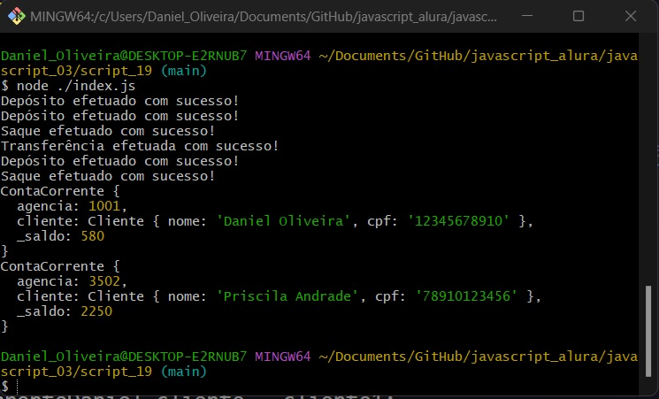

##
### JavaScript: Programando a Orientação a Objetos
##

<p align="center">
  
</p>


##
### Parte 1 - Repetição de código
##


### 1 - Introdução

**Introdução**

- Visual Studio Code
  - Link: https://code.visualstudio.com/Download


- NodeJS
  - Link; https://nodejs.org/en


- Exemplo:
  - script_01


### 2 - Preparando o ambiente

**Preparando o ambiente**


Para esse curso precisaremos usar o NodeJS a partir da versão 13.5 pois ela adiciona a capacidade de usarmos módulos JS dentro do Node.

Caso você tenha uma versão mais antiga do Node em sua máquina e não possa desinstalá-la, nossa recomendação é que você instale o Node Version Manager(NVM) para que possa alterar entre versões de forma mais simples.

Caso esteja usando um sistema Windows vocês podem usar o gerenciador de pacotes Chocolatey, que auxilia na instalação do NVM no Windows.

- Node Version Manager(NVM)
  - Link: https://github.com/nvm-sh/nvm
- Chocolatey
  - Link: https://community.chocolatey.org/packages/nvm

- Exemplo:
  - script_02


### 3 - Entendendo o problema do cliente

**Entendendo o problema do cliente**


- Exemplo:
  - script_03


### 4 - Nossa primeira classe

**Nossa primeira classe**

- Exemplo:
  - script_04


### 5 - Refletindo sobre classes

**Refletindo sobre classes**


Vimos que a criação de uma classe pode ser feita através da palavra-chave `class` e com isso definimos quais atributos queremos que essa classe possua.

Sabendo que classes são apenas um dos recursos da linguagem Javascript, quando é que devemos criar ou não uma classe ?

- Selecione uma alternativa

- A: Devemos evitar o uso de classes, uma vez que elas tornam nosso programa mais lento e difícil de ser compreendido.


- B: Classes definem uma forma de organizarmos uma série de informações repetidas no nosso código e por isso devemos usar elas quando temos código que se repete e que faz parte de um contexto coeso.
`Exatamente. Se tivermos código que se repete porém não forma um contexto coeso, provavelmente teremos que criar duas classes, cada uma delimitando um contexto único que faça sentido.` 


- C: Só podemos usar classes onde tivermos código repetido. Não devemos usar elas em mais nenhum lugar.


- Exemplo:
  - script_05


### 6 - O que aprendemos?

**O que aprendemos?**

O que aprendemos nessa aula:

- Criando classes
- O que são atributos
- Instâcia/Objeto
- Operador new

- Exemplo:
  - script_06


##
### Parte 2 - Adicionando comportamentos
##


### 7 - Projeto da Aula anterior

**Projeto da Aula anterior**


- Exemplo:
  - script_07


### 8 - Comportamentos de classes

**Comportamentos de classes**


- Exemplo:
  - script_08


### 9 - Atributos Privados

**Atributos Privados**

- Link: https://github.com/tc39/proposal-class-fields

- Exemplo:
  - script_09


### 10 - Proposta de campos Privados

**Proposta de campos Privados**

Aqui você pode encontrar a proposta que está sendo feita para uma sintaxe de campos privados dentro do JS.

- Link: https://github.com/tc39/proposal-class-fields#private-fields

- Exemplo:
  - script_10


### 11 - Sobre métodos

**Sobre métodos**

O que aprendemos sobre métodos/funções?

"...que nos ajudam a criar um..."

- Selecione 3 alternativas

- A: Função e método são termos sinônimos e que nós ajudam a criar um vocabulário mais rico dentro do nosso sistema
`Correta! Usamos métodos para dar nomes aos comportamentos que nossa classe possui e isso facilita a comunicação dentro da equipe`

- B: Um método pode receber qualquer quantidade de parâmetros.
`Correto, um método pode ter nenhum, um ou mais parâmetros. Essa é a maneira de passarmos informações para podermos reutilizar métodos em diferentes cenários`

- C: Um método nunca consegue acessar atributos da classe que ele pertence.


- D: Um método define o comportamento ou a maneira de fazer algo.
`Correto, esse é o objetivo de métodos, definir o que um objeto saber fazer. O comportamento é implementado dentro do método.`

- E: Nunca devemos chamar métodos diretamente de dentro de uma classe


- Exemplo:
  - script_11


### 12 - Encapsulamento

**Encapsulamento**

Criamos métodos para proteger atributos e informações sensíveis de nossas classes. Porém, se não fizermos nada, essas informações ainda estão expostas e podem ser alteradas manualmente.

Sobre a proteção de atributos, marque as alternativas corretas:

- Selecione 2 alternativas

-A: Não precisamos nos preocupar com proteção de atributos se tivermos os métodos necessários para alterar aquele atributo.


-B: Por padrão no JS utilizamos o "_" para indicar que um atributo é privado e não deveria ser alterado.
`Isso mesmo! Apesar de ainda ser possível alterar essa propriedade isso é considerado uma má prática e estamos quebrando o encapsulamento da classe.`

-C: Atualmente no Js nenhum atributo ou método é realmente privado
`Sim, o JS é uma linguagem de escopo aberto e por isso é possível visualizar qualquer atributo ou propriedade de nossa classe.`

- Exemplo:
  - script_12


### 13 - Métodos com retorno

**Métodos com retorno**

- Exemplo:
  - script_13


### 14 - O que aprendemos?

**O que aprendemos?**


O que aprendemos nessa aula:

- Criação de métodos
- Palavra chave this
- Encapsulamento
- Proposta de atributos privados
- Return e early return

- Exemplo:
  - script_14


##
### Parte 3 - Modularizando código
##


### 15 - Projeto da Aula anterior

**Projeto da Aula anterior**

- Exemplo:
  - script_15


### 16 - Modulos JavaScript

**Modulos JavaScript**

- Package.json
```
npm init
```

```json
"type": "module" 
```

- Exemplo:
  - script_16


### 17 - Organizando código

**Organizando código**

A organização de um projeto de programação é algo muito importante, isso pois conforme o sistema cresce, ainda seremos capazes de encontrar de forma fácil as classes e trechos de código que necessitam de manutenção.

Dessa forma, para que serve a criação de módulos no JavaScript?

- Selecione uma alternativa

- A: Só devemos usar módulos quando temos código muito grande e que não conseguimos fazer caber em uma única tela.


- B: Módulos servem apenas para conseguirmos exportar código de bibliotecas externas ao nosso projeto.


- C: Criamos módulos para compartilhar código entre os diferentes arquivos do meu sistema, ajudando na organização dele.
`Isso, dentro do JS cada arquivo é considerado um módulo e podemos escolher o que queremos exportar ou não a partir dele.`

- Exemplo:
  - script_17


### 18 - O package.json

**O package.json**

Para melhorarmos a organização do nosso código e podermos separar as classes em diversos arquivos, precisamos usar módulos de Javascript e, para isso, criamos um arquivo chamado `package.json`. Mas o que é esse arquivo?

O `package.json` é um arquivo muito utilizado em aplicações `JS` modernas que guarda vários dados de nossa aplicação. O arquivo gerado para este curso tem apenas algumas informações.

```json
{
  "name": "bytebank",
  "version": "1.0.0",
  "description": "Projeto do ByteBanck para seus clientes",
  "main": "index.js",
  "scripts": {
    "test": "echo \"Error: no test specified\" && exit 1"
  },
  "author": "Daniel Oliv",
  "license": "ISC",
  "type": "module" 
}
```

Algumas delas são simples de entender, como nome, versão, descrição e autor. Outras, como o campo script, já são mais difíceis de entender sem uma explicação mais detalhada.

Como desenvolvedores é normal queremos reaproveitar código de outras pessoas e bibliotecas que estão disponíveis para nosso time. Dessa forma, agilizamos o desenvolvimento de nossas aplicações. Mas onde podemos encontrar essas bibliotecas e código feitos pela comunidade?

Achamos essas bibliotecas dentro de gerenciadores de pacote – pense neles como um lugar centralizado onde toda a comunidade pode subir e compartilhar códigos para que outros desenvolvedores usem. E é justamente para organizar essa série de pacotes e bibliotecas que o package.json foi criado. Com ele é fácil de saber qual a versão do pacote, o nome dele, quem fez aquele código etc.

No caso do Javascript o gerenciador de pacotes mais utilizado é o NPM – Node package manager.

- NPM https://www.npmjs.com/

"Ok, mas e essa tag de script?"

Até este momento no curso não fizemos muitas operações complicadas, pois só estamos usando o terminal para chamar o interpretador do NodeJS e pedindo para ele executar o arquivo que queremos. Mas conforme nosso projeto cresce ou usamos outras bibliotecas para desenvolver a aplicação, é comum que o comando que precisamos rodar no terminal fique longo ou que ele precise de alguns parâmetros especiais. Como normalmente estamos trabalhando em equipe, não queremos que alguém na nossa equipe precise ficar perguntando o tempo todo qual o comando precisa escrever para o programa rodar. É nesse momento que usamos os scripts do package.json.

Podemos escrever um script com o comando que colocaríamos no terminal, por exemplo:

```json
"scripts": {
    "start": "node index.js"
}
```

E ao invés de escrever esse comando podemos chamar o script com o comando npm start. Dessa forma não precisamos lembrar de todo o comando sempre que vamos executar o programa. Se você quiser saber mais, veja na documentação do NPM os tipos de scripts e os casos de uso.

"E por que eu preciso disso no meu programa agora?"

Como esse arquivo de configurações está presente em praticamente todo projeto de Javascript moderno, algumas ferramentas usam-no para colocar informações de configuração que elas precisam. No caso do NodeJS eles escolheram adicionar uma propriedade chamada "type" dentro desse arquivo e, sempre que vão executar algum código JS, eles leem essa propriedade e configuram o interpretador do JS de acordo com o valor lido.

Como os módulos JS são uma coisa nova e experimental, dentro desse interpretador do Node não é interessante deixá-lo configurado para tratar todo arquivo como um módulo, pois muitos projetos antigos teriam problemas ao atualizar a versão do Node que estão usando.

Então, esta é a opção que eles encontraram para deixar quem quisesse usar os módulos JS conseguir configurar a ferramenta para fazer os testes, e quem não quisesse não teria problemas e não precisaria mudar nenhuma configuração.

Se você quiser saber mais sobre as propriedades que esse arquivo suportam você pode encontrá-las nesta página da documentação.

- Package.json: https://docs.npmjs.com/cli/v10/configuring-npm/package-json

- Exemplo:
  - script_18


### 19 - Composição de classes

**Composição de classes**

<p align="center">
  
</p>

- Exemplo:
  - script_19


### 20 - Tipo de valor e tipo de referência

**Tipo de valor e tipo de referência**

- Exemplo:
  - script_20


### 21 - Gerenciamento de memória

**Gerenciamento de memória**

Ao criarmos um programa em qualquer linguagem de programação, precisamos utilizar variáveis para guardar valores durante a execução de nossos programas. Cada uma dessas variáveis é armazenada em um lugar na memória do computador.

Porém, vimos que, dependendo dos valores que uma variável guarda, seu comportamento dentro do código pode variar, passando como uma cópia de seu valor ou como uma referência ao espaço de memória onde ela está guardada. O JS faz isso baseado justamente nos valores que a variável guarda. Tipos primitivos são sempre passados como um valor, enquanto tipos não primitivos sempre são passados por referência.

"Mas o que são tipos primitivos?"

- Link: https://developer.mozilla.org/pt-BR/docs/Glossary/Primitive

Tipos primitivos são os valores mais simples que a linguagem consegue trabalhar e geralmente são implementados no nível mais baixo da linguagem. Isso significa que eles não são representados como um objeto e por isso não possuem métodos ou atributos.

Um tipo primitivo é simplesmente um valor em sua forma mais simples de representação. Eles também são imutáveis, uma vez declarados seu valor, nunca muda.

Em Javascript, os tipos primitivos são:

- String (texto);
- Number (número);
- Boolean;
- Null;
- undefined;
- Symbol.

Qualquer outro tipo que encontramos em nossas aplicações, como Objetos, Arrays, etc... não são tipos primitivos e por isso seu comportamento é distinto. Variáveis não primitivas são mutáveis por natureza e tem potencial para armazenar estruturas muito mais complexas, o que torna as operações de cópia desses valores muito ineficiente.

"Mas se o JavaScript não o copia, o que ele faz?"

Quando criamos um objeto dentro do JavaScript ocorre a reserva de um espaço na memória local que chamamos de heap. Ao fazer isso, o que o JavaScript guarda na nova variável não é o valor do Objeto que criamos, mas sim o endereço de memória onde os valores estão salvos.

Dessa forma, ao declararmos uma variável que armazena informações dentro do heap, o que estamos fazendo é "alugar" um espaço da memória, o qual funções podem acessar. Isso torna as operações muito mais eficientes, mas tem um problema: quaisquer alterações no conteúdo armazenado pelos objetos não primitivos afetam todas as variáveis que o referenciam.

Como essas variáveis são links para espaços na memória, dizemos que elas são um "tipo de referência" enquanto que os tipos primitivos são "um tipo de valor".

Caso você queira ver em detalhes como essa operação de alocação de memória é feita, leia esse artigo sobe o modelo de gerenciamento de memória do JavaScript.

- Link: https://medium.com/reactbrasil/como-o-javascript-funciona-gerenciamento-de-mem%C3%B3ria-como-lidar-com-4-vazamentos-comuns-de-5cfa341b9e39

- Exemplo:
  - script_21


### 22 - O que aprendemos?

**O que aprendemos?**

O que aprendemos nessa aula:

- Package.json
- Modules
- import/export
- Quais as vantagens de ter um código onde usamos classes e composição ao invés de tipos - primitivos
- Tipos de valor e tipos de referência
- Alterando dinamicamente um objeto

- Exemplo:
  - script_22


##
### Parte 4 - Acessando atributos privados
##


### 23 - Projeto da Aula anterior

**Projeto da Aula anterior**

- Exemplo:
  - script_23
  

### 24 - Null e undefined

**Null e undefined**

- Exemplo:
  - script_24


### 25 - Getters e Setters

**Getters e Setters**

- Exemplo:
  - script_25


### 26 - Encapsulando com assessores

**Encapsulando com assessores**

Sobre os assessores do tipo get e set marque as alternativas corretas:

- Selecione 2 alternativas

- A: Usando assessores do tipo set podemos alterar a regra de como um atributo pode ou não ser modificado sem precisar alterar isso em diversos pontos do código
`Excelente! Essa é a ideia mesmo, assim se qualquer regra de atribuição mudar só precisamos modificar um único lugar.`

- B: Podemos usar assessores do tipo get para atribuir novos valores para um atributo.


- C: Usar assessores do tipo set é uma boa prática para garantirmos que a atribuição de propriedades está sempre segura
`Sim! Chamamos essa ideia de proteger atributos de nossas classes de encapsulamento e devemos sempre manter o máximo de encapsulamento possível.`

- Exemplo:
  - script_26


### 27 - O que aprendemos?

**O que aprendemos?**

O que aprendemos nessa aula:

- Diferenças entre null e undefined
- Aprofundando nos conceitos de referências a um espaço de memória
- Get e Set
- Melhor encapsulamento da classe
- Protegendo atributos sensíveis


- Exemplo:
  - script_27


##
### Parte 5 - Construtores e estáticos
##


### 28 - Projeto da Aula anterior

**Projeto da Aula anterior**

- Exemplo:
  - script_28


### 29 - Construtores

**Construtores**

- Exemplo:
  - script_29


### 30 - Utilizando Construtores

**Utilizando Construtores**


Abaixo, temos algumas afirmações a respeito da utilização de construtores.

Qual delas é verdadeira?

- Selecione uma alternativa

- A: Construtores são utilizados para inicializar os atributos.
`Correta! A inicialização de atributos é a principal responsabilidade do construtor.`

- B: Construtores não têm utilidade real, podemos deixar os atributos públicos e defini-los manualmente.


- C: Construtores não podem receber parâmetros.

- Exemplo:
  - script_30


