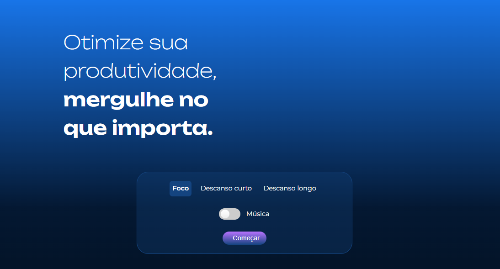

##
### JavaScript: manipulando elementos no DOM
##

<p align="center">
  
</p>


##
### Parte 1 - Iniciando o projeto Fokus
##


### 1 - Apresentação

**Apresentação**

- É necessário saber:

- HTML
- CSS
- Funções
- Métodos do JavaScript


- Exemplo:
  - script_fokus_01


### 2 - Preparando o ambiente

**Preparando o ambiente**

Boas-vindas, Dev!

Esta será uma jornada de muito aprendizado e prática, para você dominar a Manipulação de elementos no DOM com JavaScript. Para isso, vamos dar vida ao projeto Fokus, um sistema de temporizador, que ajuda a pessoa usuária a focar nas suas atividades do dia a dia.

Arquivos iniciais do projeto

Você pode visualizar os arquivos do curso, acessando o GitHub ou fazendo o download direto.

Sobre o Design do projeto

Caso queira conferir o Design do projeto, você pode acessar o Figma.

Recomendo utilizar o mesmo editor de código utilizado nas aulas. Você pode baixá-lo clicando em VScode. Também é possível baixar a extensão do VSCode utilizada no curso, o Live Server.

- Visual Studio Code:
  - Link: https://code.visualstudio.com/download
  - `Live Server`


- Figma:
  - Link: https://www.figma.com/file/dEaMv34Wd5G7TBMPo8fPlK/Projeto-Fokus?type=design&node-id=35-181&mode=design&t=wNoLT8r685HYPzNO-0


- Exemplo:
  - script_fokus_02


### 3 - Conhecendo métodos do DOM

**Conhecendo métodos do DOM**

```js
/*console browser*/
// Métodos para pegar elementos da tela


clear //limpa o console
document.querySelector('button'); // pegar um elemento especifico
document.querySelectorAll('button'); //pega todos elementos button
document.querySelector('.app__card-button--curto'); //pegando elemento de uma classe

document.getElementsByClassName('app__card-button--curto'); //pega o elemento pelo nome da classe, não reconhece com o .app__card-button--curto
document.getElementById('start-pause');  //pega o elemento pelo id
```

- DOM: Document Object Model

- Exemplo:
  - script_fokus_03


### 4 - Selecionando todos os botões com JavaScript

**Selecionando todos os botões com JavaScript**

Você e um colega de equipe, chamado Enzo, estão desenvolvendo o projeto Fokus. Ele está com dificuldade em pegar todos os botões de uma só vez para manipulá-los no DOM.

Qual das alternativas abaixo traz o método do JavaScript correto para capturar todos os botões de uma vez?

- Selecione uma alternativa

- A: Use o método `document.getElementsByID('botão')` para pegar todos os botões.


- B: Utilize o método `document.querySelector('botão')` e o JavaScript vai automaticamente selecionar todos os botões.


- C: Utilize o método `document.getElementByTagName('botão')` já que esta função busca pelos elementos com a mesma tag.


- D: Utilize o método `document.querySelectorAll('button')` porque vai retornar uma node list com todos os elementos de botão.
`Parabéns! O método document.querySelectorAll retorna todos os elementos correspondentes a um seletor ou tag, não apenas o primeiro.`

- E: A captura de todos os botões não é possível em JavaScript.

- Exemplo:
  - script_fokus_04


### 5 - Alterando data attributes

**Alterando data attributes**


- Exemplo:
  - script_fokus_05


### 6 - Para saber mais: EventListeners

**Para saber mais: EventListeners**

Para entendermos bem sobre este assunto, primeiro precisamos esclarecer uma coisa: O que é DOM? DOM é a sigla para Document Object Model (Modelo de Objeto de Documento) e é uma forma padronizada de representar e interagir com objetos em documentos HTML e XML. O DOM representa a estrutura de um documento através de uma árvore de objetos, onde cada objeto representa uma parte do documento.

Entender essa definição ajuda a compreender a importância dos eventos e de como eles funcionam no DOM (Document Object Model), sendo essencial para avançar seus estudos em JavaScript.

- O que é um Evento no DOM?

Pense nisso como sinais que o navegador envia quando algo acontece - como um usuário que clica em um botão em sua página web, por exemplo. Quando um evento ocorre, você tem a capacidade de reagir a ele e executar algumas ações, como exibir uma mensagem para o usuário, alterar ou adicionar algum elemento na página.

O Método `addEventListener`
Antes de mergulharmos nos diferentes tipos de eventos, vamos entender rapidamente como o método addEventListener funciona. Ele é um método disponível para todos os elementos HTML e permite que registremos funções (callbacks) que serão chamadas quando um evento específico ocorrer.

A sintaxe básica é a seguinte:

`elemento.addEventListener(evento, callback);`

- Onde:
  - elemento: É o elemento HTML ao qual queremos associar o evento.
  - evento: É uma string que representa o tipo de evento que desejamos capturar.
  - callback: É a função que será chamada quando o evento ocorrer.

- Tipos de Eventos

- Eventos de clique (click)

Os eventos de clique são alguns dos mais utilizados em desenvolvimento web. Eles ocorrem quando o usuário clica em um elemento específico da página, como um botão, um link ou até mesmo em uma imagem. Podemos usar o evento click para executar ações quando o usuário interage com esses elementos.

Exemplo:
```js
// HTML <button id="meuBotao">Clique aqui</button>

const meuBotao = document.getElementById("meuBotao");
meuBotao.addEventListener("click", function() {
  alert("O botão foi clicado!");
});
```

Quando o usuário clicar no botão com o texto "Clique aqui", um alerta será exibido com a mensagem "O botão foi clicado!".

- Eventos de submissão de formulário (submit)

Quando temos um formulário em nossa página, podemos usar o evento submit para capturar a submissão do formulário pelo usuário. Isso nos permite executar ações como validar os dados inseridos antes de enviá-los para o servidor.

Exemplo:
```js
//HTML <form id="meuFormulario">
//HTML     <input type="text" name="nome" />
//HTML     <input type="submit" value="Enviar" />
//HTML  </form>

const meuFormulario = document.getElementById("meuFormulario");
meuFormulario.addEventListener("submit", function(event) {
  event.preventDefault(); // Impede o envio padrão do formulário
  const nome = event.target.elements.nome.value;
  alert(`O formulário foi enviado com o nome: ${nome}`);
});
```

Quando o usuário preencher o campo de texto do formulário e clicar no botão "Enviar", um alerta será exibido com a mensagem "O formulário foi enviado com o nome: [nome inserido no campo]".

Eventos de teclado (keydown, keyup, keypress)
Os eventos de teclado permitem que respondamos às ações do usuário no teclado, como pressionar ou soltar uma tecla específica. Existem três principais tipos de eventos de teclado:

keydown: Ocorre quando uma tecla é pressionada. keyup: Ocorre quando uma tecla é solta. keypress: Ocorre quando uma tecla é pressionada e ainda não foi solta.

Exemplo:

```js
//HTML<input type="text" id="meuInput" />

const meuInput = document.getElementById("meuInput");
meuInput.addEventListener("keydown", function(event) {
  console.log(`Tecla pressionada: ${event.key}`);
});
```

Quando o usuário pressiona uma tecla enquanto o cursor está no campo de texto, o evento keydown será acionado e o código imprimirá no console a mensagem "Tecla pressionada: [tecla pressionada]".

Eventos de foco (focus, blur)
Os eventos de foco são usados quando queremos capturar quando um elemento recebe ou perde o foco. O evento focus ocorre quando o elemento ganha o foco (por exemplo, quando clicamos em um campo de formulário), enquanto o evento blur ocorre quando o elemento perde o foco.

Exemplo:

```js
//HTML <input type="text" id="meuCampo" />

const meuCampo = document.getElementById("meuCampo");
meuCampo.addEventListener("focus", function() {
  console.log("Campo ganhou o foco.");
});

meuCampo.addEventListener("blur", function() {
  console.log("Campo perdeu o foco.");
});
```

Quando o usuário clicar no campo de texto, o evento focus será acionado e o código imprimirá no console a mensagem "Campo ganhou o foco.". Quando o usuário clicar fora do campo, fazendo-o perder o foco, o evento blur será acionado e o código imprimirá no console a mensagem "Campo perdeu o foco.".

O método addEventListener em JavaScript é uma poderosa ferramenta para lidar com eventos em elementos HTML. Através dos diferentes tipos de eventos disponíveis, podemos criar páginas web mais interativas e responsivas, melhorando a experiência do usuário.

Abordamos os eventos mais comuns, e também existem muitos outros que podem ser explorados para atender às necessidades específicas de cada projeto. Portanto, o conhecimento sobre eventos e a habilidade de utilizá-los adequadamente são fundamentais para se tornar uma pessoa desenvolvedora web mais eficiente e versátil.

- Exemplo:
  - script_fokus_06


### 7 - Desafio: adicionando evento de click

**Desafio: adicionando evento de click**

- Agora é com você!

Estamos desenvolvendo o projeto Fokus juntos, por isso, conto com sua ajuda para inserir um evento de interação com a pessoa usuária no botão “Descanso longo”. Similar ao que fizemos em aula referente aos botões de “Foco” e “Descanso curto”.

- Para o desafio, seguem algumas dicas:
  - Adicione um evento de clique (click) no botão "Descanso longo";
  - Quando o botão for clicado, defina o valor 'descanso-longo' para o atributo data-contexto;
  - Isso permitirá que a cor azul seja aplicada na tela, através do seletor data-contexto="descanso-longo" no arquivo CSS, na linha 18.

- Opinião do instrutor

Conseguiu resolver o desafio? Espero que sim! :)

Abaixo segue a forma como fiz:

Código JavaScript:

```js
const longoBt = document.querySelector('.app__card-button--longo');

longoBt.addEventListener('click', () => {
    html.setAttribute('data-contexto', 'descanso-longo');
});
```

- Print do resultado na tela, após clique no botão “Descanso longo”:

<p align="center">
  
</p>


- Exemplo:
  - script_fokus_07


### 8 - O que aprendemos?

**O que aprendemos?**

- Nessa aula, você aprendeu como:
  - Iniciar a manipulação no DOM: Entendemos o que é o DOM (Document Object Model) e como ele representa a árvore de nós e objetos;
  - Trabalhar com Elementos no DOM: Aprendemos a manipular elementos no DOM usando JavaScript, especificamente nos concentrando na manipulação de botões;
  - Usar Seletores: Dominamos o uso de vários seletores e métodos, como querySelector, `querySelectorAll`, `getElementsByClassName` e `getElementById`, para selecionar elementos no DOM;
  - Diferenciar o DOM vs Document: Compreendemos as diferenças entre o Document e o DOM; o Document é um objeto global que representa o HTML, enquanto o DOM é uma representação conjunta de vários elementos;
  - Criar variáveis para elementos HTML: Aprendemos como criar uma variável para representar um elemento HTML em JavaScript.

- Exemplo:
  - script_fokus_08


##
### Parte 2 - Manipulando elementos da página
##


### 9 - Projeto da aula anterior

**Projeto da aula anterior**

- Exemplo:
  - script_fokus_09


### 10 - Alterando imagens

**Alterando imagens**

- Exemplo:
  - script_fokus_10


### 11 - Para saber mais: trabalhando com atributos

**Para saber mais: trabalhando com atributos**

Agora, vamos falar sobre a manipulação de atributos de elementos no DOM usando JavaScript. Existem várias formas de manipular esses elementos, mas vamos nos concentrar em quatro métodos muito úteis e comuns: `getAttribute`, `setAttribute`, `hasAttribute` e `removeAttribute`.

- getAttribute:

O método `getAttribute` é usado para obter o valor de um atributo específico de um elemento HTML. Ele recebe um argumento, que é o nome do atributo que desejamos recuperar o valor. Por exemplo:

```js
// HTML: <div id="meuElemento" data-info="Exemplo de atributo">

const elemento = document.getElementById('meuElemento');
const valorDoAtributo = elemento.getAttribute('data-info');
console.log(valorDoAtributo); // Saída: "Exemplo de atributo"
```

Neste exemplo, o método getAttribute foi usado para obter o valor do atributo data-info do elemento com o ID "meuElemento".

- setAttribute:

O método `setAttribute` é usado para definir ou modificar o valor de um atributo em um elemento HTML. Ele aceita dois argumentos: o primeiro é o nome do atributo que queremos definir ou modificar, e o segundo é o valor que queremos atribuir a esse atributo. Se o atributo já existir, o método setAttribute irá sobrescrevê-lo; caso contrário, ele criará um novo atributo. Por exemplo:

```js
// HTML: <p id="meuParagrafo">Texto inicial</p>


const paragrafo = document.getElementById('meuParagrafo');
paragrafo.setAttribute('id', 'paragrafoModificado');
paragrafo.setAttribute('data-novo-atributo', 'Novo valor');
```

Após a execução deste código, o parágrafo terá seu ID alterado para "paragrafoModificado" e será adicionado um novo atributo data-novo-atributo com o valor "Novo valor".

- hasAttribute:

O método `hasAttribute` é usado para verificar se um elemento possui um atributo específico. Ele recebe um argumento, que é o nome do atributo que queremos verificar. O método retornará true se o atributo existir e false se o atributo não estiver presente. Vejamos um exemplo:

```js
// HTML: <a href="https://www.exemplo.com" id="meuLink">Link de exemplo</a>


const link = document.getElementById('meuLink');
const temHref = link.hasAttribute('href');
console.log(temHref); // Saída: true
const temTarget = link.hasAttribute('target');
console.log(temTarget); // Saída: false
```

Neste exemplo, o método hasAttribute foi usado para verificar se o elemento com o ID "meuLink" possui o atributo "href" (que é verdadeiro) e se possui o atributo "target" (que é falso).

- removeAttribute:

O método `removeAttribute` é usado para remover um atributo específico de um elemento HTML. Ele recebe um argumento, que é o nome do atributo que desejamos remover. Por exemplo:

```js
// HTML: 


const imagem = document.getElementById('minhaImagem');
imagem.removeAttribute('alt');
```

Após a execução desse código, o atributo alt da imagem será removido, tornando-a menos acessível para pessoas com deficiência visual e fazendo com que o navegador não exiba um texto alternativo quando a imagem não puder ser carregada.

Em resumo, os métodos getAttribute, setAttribute, hasAttribute e removeAttribute são ferramentas poderosas no JavaScript para interagir com atributos de elementos HTML. Eles permitem que os desenvolvedores obtenham, definam, verifiquem e removam atributos conforme necessário, tornando a manipulação do DOM mais eficiente e flexível. Ao utilizar esses métodos de forma adequada, é possível criar experiências web mais dinâmicas e interativas para os usuários.


- Exemplo:
  - script_fokus_11


### 12 - Separando funções e métodos

**Separando funções e métodos**

- Exemplo:
  - script_fokus_12


### 13 - Alterando texto da página

**Alterando texto da página**

- Exemplo:
  - script_fokus_13


### 14 - Faça como eu fiz: refatoração e manipulação de elementos

**Faça como eu fiz: refatoração e manipulação de elementos**

Aprendemos nessa aula a refatorar o código do projeto Focus para torná-lo mais legível e reutilizável, assim como utilizar o método "innerHTML" para alterar o texto exibido na tela de acordo com o contexto selecionado (Foco, Descanso Curto e Descanso Longo). E é muito importante que você implemente o que aprendeu. Por isso, é sua vez de praticar.

- Crie uma função chamada "Alterar Contexto" para automatizar a mudança de imagens, cores de fundo dos elementos e textos;
- Dentro da função, utilize os parâmetros para receber os valores de contexto (Foco, Descanso Curto, Descanso Longo);
- Atualize os eventos de clique dos botões "Descanso Curto" e "Descanso Longo" para chamar a função "Alterar Contexto" com os respectivos parâmetros;
- Crie uma variável para referenciar o elemento `<h1>` que contém o texto a ser alterado usando ‘document.querySelector’ e a classe ‘app__title’;
- Utilize o método ‘innerHTML’ para modificar o conteúdo do elemento ‘título’ com os textos correspondentes aos contextos "Foco", "Descanso Curto" e "Descanso Longo";
- Se desejar, utilize o design pronto no Figma como base.
  - Link: https://www.figma.com/file/dEaMv34Wd5G7TBMPo8fPlK/Projeto-Fokus?type=design&mode=design

Teste as alterações no navegador para verificar se as imagens e cores de fundo mudam corretamente quando você clica nos botões “Foco”, "Descanso Curto" e "Descanso Longo".

- Opinião do instrutor

Com esses passos, você estará concluindo a etapa de alteração de elementos do projeto Fokus e poderá avançar para o próximo passo, que é a customização dos estilos dos botões conforme o clique.

Caso queira, você pode visualizar o código dessa aula no repositório do curso.

Boa sorte!

- Exemplo:
  - script_fokus_14


### 15 - Inserindo elementos na tela

**Inserindo elementos na tela**

Você está trabalhando em um projeto web e precisa inserir um novo elemento de parágrafo em uma seção específica do seu documento HTML utilizando JavaScript. Você decidiu que a melhor maneira de fazer isso é através do método innerHTML.

Qual das seguintes opções mostra a maneira correta de usar `innerHTML` para inserir um novo elemento de parágrafo com texto "Olá, mundo!" na seção com id "minhaSecao"?

- Selecione uma alternativa

- A: `document.getElementById("minhaSecao").innerHTML = "<p>Olá, mundo!</p>"`
`Parabéns! Este código define corretamente o innerHTML do elemento com id "minhaSecao" para um novo elemento de parágrafo contendo o texto "Olá, mundo!".`


- B: `document.getElementById("minhaSecao").innerHTML("<p>Olá, mundo!</p>")`


- C: `document.getElementById("minhaSecao").innerText = "<p>Olá, mundo!</p>"`


- D: `document.getElementById("<p>Olá, mundo!</p>").innerHTML = "minhaSecao"`

- Exemplo:
  - script_fokus_15


### 16 - Lista de exercícios

**Lista de exercícios**


- Vamos praticar o que aprendemos até aqui?

- 1) Criando funções no JavaScript
Na construção do projeto Fokus, crie uma função chamada alterarContexto() que altera o caminho da imagem e a cor de fundo, de acordo com o contexto de cada um dos três temporizadores: “Foco”, “Descanso curto” e “Descanso longo”.

- 2) Alterando imagens e estilos dinamicamente
A próxima etapa da construção do projeto Fokus é a seguinte: utilize a função alterarContexto(), criada criada anteriormente, para adicionar um evento de click, alterando o contexto de imagem e cor de fundo, de acordo com o clique em cada um dos botões de foco.

- 3) Alterando textos dinamicamente
Até esta etapa de desenvolvimento do projeto Fokus, o código teve algumas repetições que podem ser melhoradas. Vamos corrigir isso? Assim, refatore o código, passando os valores de cada contexto dinamicamente na forma de parâmetro para a função alterarContexto(). Além disso, insira frases de acordo com cada contexto, através da variável titulo (já criada):

- O contexto de foco terá a frase: “Otimize sua produtividade, mergulhe no que importa.”
- O contexto de descanso curto terá a frase: “Que tal dar uma respirada? Faça uma pausa curta!”
- O contexto de descanso longo terá a frase: “Hora de voltar à superfície. Faça uma pausa longa.”

- Opinião do instrutor

Veja as soluções dos exercícios. Lembre-se de que há várias maneiras de solucionar um mesmo problema (e tudo bem caso seu código tenha saído diferente). O importante é que ele esteja organizado, bem escrito e funcione.

- 1) Criando funções no JavaScript
Utilize o método do JavaScript setAttribute para alterar elementos HTML dinamicamente. O código pode ficar assim:

```js
function alterarContexto(contexto, imagem) {
    html.setAttribute('data-contexto', contexto);
    banner.setAttribute('src', `/imagens/${imagem}`);
  }
```

- 2) Alterando imagens e estilos dinamicamente
Crie eventos de clique para cada um dos três contextos do projeto, alterando a classe com os estilos de cor de fundo, e o caminho das imagens de cada contexto:

```js
  const focoBt = document.querySelector('.app__card-button--foco');
  focoBt.addEventListener('click', () => {
    alterarContexto('foco', 'foco.png');
  });
  
  const curtoBt = document.querySelector('.app__card-button--curto');
  curtoBt.addEventListener('click', () => {
    alterarContexto('descanso-curto', 'descanso-curto.png');
  });
  
  const longoBt = document.querySelector('.app__card-button--longo');
  longoBt.addEventListener('click', () => {
    alterarContexto('descanso-longo', 'descanso-longo.png');
  });
```

- 3) Alterando textos dinamicamente
Para alterar os textos dinamicamente, podemos prosseguir com o seguinte código:

```js
focoBt.addEventListener('click', () => {
    alterarContexto('foco')
})

curtoBt.addEventListener('click', () => {
    alterarContexto('descanso-curto')
})

longoBt.addEventListener('click', () => {
    alterarContexto('descanso-longo')
})

function alterarContexto(contexto) {
    html.setAttribute('data-contexto', contexto)
    banner.setAttribute('src', `/imagens/${contexto}.png`)
    switch (contexto) {
        case "foco":
            titulo.innerHTML = `
            Otimize sua produtividade,<br>
                <strong class="app__title-strong">mergulhe no que importa.</strong>
            `
            break;
        case "descanso-curto":
            titulo.innerHTML = `
            Que tal dar uma respirada? <strong class="app__title-strong">Faça uma pausa curta!</strong>
            ` 
            break;
        case "descanso-longo":
            titulo.innerHTML = `
            Hora de voltar à superfície.<strong class="app__title-strong"> Faça uma pausa longa.</strong>
            `
        default:
            break;
    }
}
```

Muito bom! Você chegou ao fim de mais uma lista de exercícios!

- Exemplo:
  - script_fokus_16

### 17 - O que aprendemos?

**O que aprendemos?**

Parabéns!

- Você finalizou a segunda aula. E nela você aprendeu como:
  - Alterar textos HTML com `innerHTML`: Aprendemos a alterar estrutura de conteúdo HTML com textos, tags e classes;
  - **Utilizar o método switch**: Aplicamos o método switch para alternar contextos e alterar a exibição de textos de acordo com o contexto;
  - **Refatorar o código**: Identificamos linhas de código repetidas e refatoramos o código criando a primeira função do projeto alterarContexto.

- Exemplo:
  - script_fokus_17


##
### Parte 3 - Aplicando áudio e estilos
##


### 18 - Projeto da aula anterior

**Projeto da aula anterior**

- Exemplo:
  - script_fokus_18


### 19 - Adicionando e removendo classes

**Adicionando e removendo classes**

- Exemplo:
  - script_fokus_19


### 20 - Para saber mais: manipulando classes com ClassList

**Para saber mais: manipulando classes com ClassList**

O JavaScript é uma linguagem de programação amplamente utilizada para adicionar interatividade e dinamismo às páginas da web. Uma das tarefas comuns na manipulação da interface do usuário é a alteração de classes CSS de elementos HTML. Anteriormente, a forma tradicional de fazer isso era manipular a propriedade className, que envolvia trabalhar com strings e pode ser propenso a erros. No entanto, com a introdução do método classList, a partir do ECMAScript 5, essa tarefa se tornou mais fácil e segura.

O classList é uma propriedade do JavaScript que representa uma lista de classes CSS. Ele fornece métodos que facilitam a adição, remoção e verificação de classes, tornando a manipulação de classes CSS mais eficiente e menos suscetível a erros de programação.

Além do que apresentei para você em vídeo, vamos conhecer mais formas de usar o classList?

- Adicionando uma classe

Para adicionar uma classe a um elemento HTML, podemos usar o método add() do classList. Este método aceita o nome da classe como argumento e adiciona a classe ao elemento, se ela ainda não estiver presente. Conforme exemplo a seguir:

```js
const element = document.getElementById('meuElemento');
element.classList.add('minhaClasse');
```

- Removendo uma classe

Para remover uma classe de um elemento HTML, podemos utilizar o método remove() do classList. Este método aceita o nome da classe como argumento e remove a classe do elemento, se ela estiver presente. Veja o exemplo abaixo:

```js
const element = document.getElementById('meuElemento');
element.classList.remove('minhaClasse');
```

- Alternando uma classe

O método toggle() do classList permite alternar uma classe em um elemento. Se a classe já estiver presente no elemento, o método a remove; caso contrário, ele a adiciona, conforme exemplo a seguir:

```js
const element = document.getElementById('meuElemento');
element.classList.toggle('minhaClasse');

```

- Verificando se uma classe está presente

Para verificar se uma classe específica está associada a um elemento, podemos usar o método contains() do classList, como no exemplo

```js
const element = document.getElementById('meuElemento');
if (element.classList.contains('minhaClasse')) {
  // A classe 'minhaClasse' está presente no elemento
  // Faça algo aqui...
}
```

- Substituindo classes

Como feito em aula, podemos substituir uma classe por outra usando os métodos add() e remove() em sequência.

```js
const element = document.getElementById('meuElemento');
element.classList.remove('classeAntiga');
element.classList.add('classeNova');
```

- Manipulando várias classes simultaneamente

É possível adicionar ou remover várias classes de uma vez usando o método add() ou remove() passando vários argumentos separados por vírgula. Veja o exemplo:

```js
const element = document.getElementById('meuElemento');
element.classList.add('classe1', 'classe2', 'classe3');
element.classList.remove('classe2', 'classe3');
```

O classList em JavaScript é uma ferramenta poderosa e eficiente para manipular classes CSS em elementos HTML. Com os métodos add(), remove(), toggle(), contains() e outras funcionalidades, podemos realizar tarefas de manipulação de classes de forma mais segura e simplificada, tornando nossas aplicações web mais interativas e dinâmicas.

Nota: Certifique-se de que o JavaScript seja carregado após a renderização do DOM, para que os elementos estejam acessíveis antes de tentar manipular suas classes.

- Exemplo:
  - script_fokus_20


### 21 - Inserindo objeto de áudio

**Inserindo objeto de áudio**

- Exemplo:
  - script_fokus_21


### 22 - Para saber mais: utilizando áudio em páginas da web

**Para saber mais: utilizando áudio em páginas da web**

O JavaScript é uma linguagem de programação amplamente utilizada para criar interatividade em páginas da web. Uma das funcionalidades mais interessantes que ele oferece é a capacidade de manipular áudio, permitindo que os desenvolvedores adicionem e controlem elementos de áudio em seus sites de forma dinâmica. Uma das formas mais comuns de fazer isso é usando o objeto ‘Audio’.

O objeto ‘Audio’ é uma parte do HTML5 e fornece uma interface fácil e poderosa para reproduzir e controlar arquivos de áudio em tempo real. Que tal explorar o uso, entendendo como criar, controlar, reproduzir e estilizar áudio em uma página da web?

Criando um Objeto ‘Audio’
Para criar um novo objeto ‘Audio’, podemos simplesmente usar a seguinte sintaxe:

```js
const audioElement = new Audio('caminho/do/arquivo-de-audio.mp3');
```

Substitua 'caminho/do/arquivo-de-audio.mp3' pelo caminho real do arquivo de áudio que você deseja reproduzir.

- Controles básicos de áudio

Após criar um objeto ‘Audio’, podemos controlar sua reprodução e outras propriedades usando métodos e propriedades disponíveis.

- `play()`: inicia a reprodução do áudio;
- `pause()`: pausa a reprodução do áudio;
- `currentTime`: propriedade que retorna ou define a posição atual de reprodução do áudio, em segundos;
- volume: propriedade que retorna ou define o nível de volume do áudio, variando de 0 a 1.


Exemplo de utilização dos métodos do objeto Audio:

```js
const audioElement = new Audio('caminho/do/arquivo-de-audio.mp3');

audioElement.play(); // Inicia a reprodução
audioElement.pause(); // Pausa a reprodução
audioElement.currentTime = 10; // Move para 10 segundos no áudio
audioElement.volume = 0.5; // Define o volume para metade (50%)
```

*Lembre-se de que a reprodução de áudio em páginas da web pode ser intrusiva para alguns usuários, portanto, use-o com moderação e sempre forneça controles de volume e opções de pausa aos visitantes do seu site.*

- Exemplo:
  - script_fokus_22


### 23 - Exercitando objeto Audio

**Exercitando objeto Audio**

No desenvolvimento do projeto Fokus foi necessário inserir um arquivo de áudio. Como você poderia implementar uma música de fundo que começa quando o usuário clica no input checkbox, pausa quando o usuário clica novamente no input e que continua tocando em loop?

- Selecione uma alternativa

- A:

```js
// A
let musicaFocoInput = document.querySelector("#alternar-musica");
let musica = new Audio("/sons/Luna_Rise_Part_One.mp3");
musica.loop = true;
musicaFocoInput.addEventListener("click", function() {
  musica.play();
});
```

- B:

```js
// B
let musicaFocoInput = document.querySelector("#alternar-musica");
let musica = new Audio("/sons/Luna_Rise_Part_One.mp3");
musicaFocoInput.addEventListener("click", function() {
  musica.play();
});
```

- C:

```js
// C
let musicaFocoInput = document.querySelector("#alternar-musica");
musicaFocoInput.addEventListener("change", function() {
  let musica = new Audio("/sons/Luna_Rise_Part_One.mp3");
  if (musica.paused) {
    musica.play();
  } else {
    musica.pause();
  }
});
```

- D:

```js
// D
let musicaFocoInput = document.querySelector("#alternar-musica");
let musica = new Audio("/sons/Luna_Rise_Part_One.mp3");
musica.loop = true;
musicaFocoInput.addEventListener("change", function() {
  if (musica.paused) {
    musica.play();
  } else {
    musica.pause();
  }
});
```
`Esta é a resposta correta porque adiciona a funcionalidade de loop ao áudio e atende a todos os outros requisitos da questão.`

- Exemplo:
  - script_fokus_23


### 24 - Faça como eu fiz: manipulando elementos

**Faça como eu fiz: manipulando elementos**

Nesta aula, aprendemos a utilizar o método classList do JavaScript para adicionar e remover classes dos elementos HTML dinamicamente, assim como inserir e manipular um arquivo de áudio na página.

Agora, pratique o que aprendeu seguindo estes passos:

- Adicionando e removendo estilos dos botões

  - Crie uma variável para armazenar todos os botões com a classe "appCardButton" usando document.querySelectorAll;
  - Dentro dos eventListener de cada botão, utilize o método classList.add para inserir a classe active quando o botão for clicado;
  - Na função ‘AlterarContexto’, utilize o loop forEach para iterar por cada botão e crie uma função que remova a classe ‘active’ dos botões não selecionados.

- Inserindo áudio no projeto

- No HTML, encontre o input com o id "Alternar-Musica" que controla a música;
- No JavaScript, crie uma variável chamada "musicaFocoInput" usando document.querySelector e passe o id do input como parâmetro;
- Crie uma nova variável chamada ‘musicaFoco’ e utilize o objeto Audio para criar uma instância dele com o caminho do arquivo de música "Sons/Luna-Rise-Part-1.mp3";
- Defina o atributo loop do objeto Audio como true para tocar a música em loop;
- Adicione um evento de change ao input ‘musicaFocoInput’ usando addEventListener;
- Crie uma função anônima dentro do evento para verificar se a música está pausada utilizando a propriedade paused do objeto Audio:
    - Se estiver pausada, utilize o método play para tocá-la;
    - Caso contrário, utilize o método pause para pausar a música.

- Opinião do instrutor

Faça o teste e verifique se o código está funcionando corretamente.

- Exemplo:
  - script_fokus_24


### 25 - Lista de exercícios

**Lista de exercícios**

Vamos praticar o que aprendemos até aqui?

1) Inserindo estilos dos botões com JavaScript
Crie uma página HTML simples que inclua três botões: "Foco", "Descanso Curto" e "Descanso Longo" (o layout não precisa ser muito complexo). Cada botão deve inicialmente ter um estilo básico. Utilize o JavaScript para inserir a classe active entre esses botões, de modo que, ao clicar em um botão, ele receba um estilo destacado (por exemplo, cor de fundo e borda diferenciada). Certifique-se de aplicar os conceitos de manipulação de classes com JavaScript aprendidos, alterando dinamicamente a classe active para indicar o botão selecionado.

2) Alternando o estilo dos botões com JavaScript
Com o método para aplicar a classe active nos três botões definidos no exercício anterior,, repare no seguinte: sempre quando um botão é clicado, o estilo é inserido. Para corrigir isso, aplique, na função alterarContexto, um método para retirar a classe active de modo que ela seja inserida apenas no último botão clicado.

3) Controlando a reprodução de música com um Checkbox
Desenvolva, no projeto Fokus, um input do tipo checkbox para controlar a reprodução de um arquivo de música. O arquivo de áudio, luna-rise-part-one.mp3, deve começar a tocar quando o checkbox for marcado e parar quando for desmarcado. Implemente essa lógica usando o JavaScript, criando um objeto Audio para o arquivo de música e um EventListener para o checkbox que verifica o estado da propriedade paused do objeto Audio, alternando entre os métodos play e pause conforme o estado do checkbox.

4) Reproduzindo arquivo de Audio em modo infinito
Você já aprendeu como inserir arquivos de Audio em um projeto utilizando JavaScript, e também aplicou métodos para reproduzir e pausar esse tipo de arquivo. Nesse momento, você deve utilizar das técnicas aplicadas nesta aula para fazer um arquivo de Audio ser reproduzido em modo de loop, ou seja, iniciando automaticamente sempre que finalizado.

- Opinião do instrutor

Veja as soluções dos exercícios. Lembre-se de que há várias maneiras de solucionar um mesmo problema (e tudo bem caso seu código tenha saído diferente). O importante é que ele esteja organizado, bem escrito e funcione.

1) Alternando o estilo dos botões com JavaScript
Crie um arquivo HTML e adicione três botões com os textos "Foco", "Descanso Curto" e "Descanso Longo". Adicione uma classe base aos botões para estilos iniciais e uma classe active para estilos destacados;
Utilize CSS para definir os estilos básicos dos botões e os estilos quando a classe active estiver aplicada;
Em um arquivo JavaScript separado, escreva o código para adicionar um event listener a cada botão. Quando um botão é clicado, ele deve receber a classe active, enquanto os outros botões devem ter essa classe removida.
Código JavaScript:

```js
focoBt.addEventListener('click', () => {
    alterarContexto('foco');
    focoBt.classList.add('active');
});

curtoBt.addEventListener('click', () => {
    alterarContexto('descanso-curto');
    curtoBt.classList.add('active');
});

longoBt.addEventListener('click', () => {
    alterarContexto('descanso-longo');
    longoBt.classList.add('active');
});
```

2) Alternando o estilo dos botões com JavaScript
Crie uma variável para selecionar todos os três botões;
Insira na função alterarContexto o método para retirar a classe active dos botões.
O código Javascript ficaria assim:

```js
const botoes = document.querySelectorAll('.app__card-button')

botoes.forEach(function (contexto){
  contexto.classList.remove('active');
});
```

3) Controlando a reprodução de música com um Checkbox
Adicione um input do tipo checkbox com um ID específico, por exemplo, #alternar-musica;
No seu arquivo JavaScript, crie uma variável para armazenar a referência ao checkbox usando document.querySelector('#alternar-musica');
Crie um objeto Audio para o arquivo de música desejado, passando o caminho do arquivo como parâmetro para o construtor new Audio('caminho/do/arquivo.mp3');
Adicione um EventListener ao checkbox para escutar pelo evento change. Dentro do callback deste evento, utilize a propriedade paused do objeto Audio para verificar se a música está pausada. Se estiver, chame o método play(), caso contrário, chame pause().
O código JavaScript ficaria assim:

```js
const musicaFocoInput = document.querySelector('#alternar-musica');
const musica = new Audio('sons/luna-rise-part-one.mp3');

musicaFocoInput.addEventListener('change', () => {
if (musica.paused) {
     musica.play();
    } else {
      musica.pause();
    }
});
```

4) Reproduzindo arquivo de Audio em modo infinito
Aplique na propriedade loop do objeto JavaScript Audio o valor true. O código JavaScript:

```js
musica.loop = true
```

Muito bom! Você chegou ao fim de mais uma lista de exercícios!

- Exemplo:
  - script_fokus_25


### 26 - O que aprendemos?

**O que aprendemos?**

Parabéns! Mais uma aula finalizada.

E nela você aprendeu como:

- Ativar e desativar áudio com input Checkbox: Entendemos como podemos ativar e desativar um arquivo de áudio na nossa página com a ajuda do input Checkbox;
- Criar um objeto de áudio: Aprendemos a criar uma instância da classe de áudio usando a palavra-chave 'new';
Usar propriedades e métodos de áudio: Usamos a propriedade 'paused' e os métodos 'play()' e 'pause()' para controlar a reprodução do áudio;
- Configurar áudio para loop: Fizemos com que o áudio fique em loop contínuo ao definir a propriedade "loop" para "true".

- Exemplo:
  - script_fokus_26


##
### Parte 4 - Desenvolvendoo temporizador
##


### 27 - Projeto da aula anterior

**Projeto da aula anterior**

- Exemplo:
  - script_fokus_27


### 28 - Iniciando o temporizador (setInterval)

**Iniciando o temporizador (setInterval)**

- Exemplo:
  - script_fokus_28


### 29 - Pausando o temporizador clearInterval

**Pausando o temporizador clearInterval**

- Exemplo:
  - script_fokus_29


### 30 - Animação dinâmica

**Animação dinâmica**

Você, como pessoa desenvolvedora web de uma startup tecnológica, tem a tarefa de criar uma animação na página em que elementos se movem a cada 2 segundos. Além disso, é essencial permitir ao usuário a opção de interromper a animação quando desejar.

Com base no que foi estudado sobre setInterval e clearInterval, como você organizaria o código para criar a animação que altera a cada dois segundos, mas que também pode ser interrompida pelo usuário?

- Selecione uma alternativa

- A: 
```js
let myAnim = clearInterval(moveElements, 2000);
    
function stopAnim() {
setInterval(myAnim);
}
```

- B: 
```js
let myAnim = setInterval(moveElements, 2000);
    
function stopAnim() {
clearInterval(myAnim);
}
```
`Parabéns! O código define um intervalo para a animação dos elementos usando a função moveElements, que acontecerá a cada dois segundos graças ao segundo argumento do setInterval (2000 milissegundos). A função stopAnim está utilizando clearInterval para interromper a animação quando chamada.`


- C: 
```js
function startAnim() {
setInterval(moveElements, 2000);
}

function stopAnim() {
clearInterval(startAnim);
}
```

- D: 
```js
let myAnim = setInterval(moveElements, 2000);
```


- Exemplo:
  - script_fokus_30


### 31 - Para saber mais: acessando dados com propriedades no DOM

**Para saber mais: acessando dados com propriedades no DOM**

No projeto Fokus, estamos utilizando algumas das propriedades mais conhecidas para acessar elementos no DOM, como o classList e o innerHTML, porém, existem outros igualmente importantes.

Vamos conhecê-los?

- Propriedade parentNode
  - Link: https://developer.mozilla.org/pt-BR/docs/Web/API/Node/parentNode

A propriedade parentNode é utilizada para acessar o nó pai de um elemento no DOM. Por meio dela, podemos navegar pela árvore do DOM em direção ao nó pai do elemento atual.

- Exemplo de uso:

Suponha que temos o seguinte código HTML:

```html
<div id="container">
  <p>Este é um parágrafo</p>
</div>
```

Agora, podemos usar o `parentNode` para acessar o elemento pai do parágrafo:

```js
const paragraph = document.querySelector('p');
const parentElement = paragraph.parentNode;

console.log(parentElement.id); // Saída: "container"
```

- Propriedade childNodes
  - Link: https://developer.mozilla.org/pt-BR/docs/Web/API/Node/childNodes

A propriedade `childNodes` é utilizada para acessar todos os nós filhos de um elemento no DOM. Ela retorna uma lista de nós, incluindo nós de texto e elementos HTML.

- Exemplo de uso:

Considerando o mesmo HTML do exemplo anterior, podemos usar o `childNodes` para obter todos os nós filhos do elemento com o ID "container":

```js
const container = document.getElementById('container');
const childNodes = container.childNodes;

console.log(childNodes.length); // Saída: 1 (o nó de texto "\n  " é considerado um nó filho)
console.log(childNodes[0].nodeName); // Saída: "#text"
console.log(childNodes[1].nodeName); // Saída: "P"
```

- Propriedade nextElementSibling
  - Link: https://developer.mozilla.org/en-US/docs/Web/API/Element/nextElementSibling

A propriedade `nextElementSibling` permite acessar o próximo irmão (nó adjacente) de um elemento no DOM.

- Exemplo de uso:

Vamos considerar o seguinte HTML:

```js
<ul>
  <li>Item 1</li>
  <li>Item 2</li>
  <li>Item 3</li>
</ul>
```

Agora, podemos usar o `nextElementSibling` para acessar o próximo irmão de um elemento `<li>`:

```js
const item1 = document.querySelector('li:first-child');
const item2 = item1.nextElementSibling;

console.log(item2.textContent); // Saída: "Item 2"
```

- Propriedade previousElementSibling
  - Link: https://developer.mozilla.org/en-US/docs/Web/API/Element/previousElementSibling

A propriedade `previousElementSibling` é semelhante ao `nextElementSibling`, mas permite acessar o irmão anterior (nó adjacente) de um elemento no DOM.

- Exemplo de uso:

Continuando o exemplo anterior, vamos usar o `previousElementSibling` para acessar o irmão anterior do elemento `<li>` que selecionamos:

```js
const item3 = document.querySelector('li:last-child');
const item2 = item3.previousElementSibling;

console.log(item2.textContent); // Saída: "Item 2"
```

Com essas propriedades, é possível navegar, acessar e modificar elementos HTML em uma página da web, tornando a manipulação do DOM uma tarefa poderosa para pessoas desenvolvedoras web.

É importante continuar praticando e explorando o DOM para aprofundar seu conhecimento e habilidades em JavaScript.

- Exemplo:
  - script_fokus_31


### 32 - Desafio: inserindo áudios no projeto

**Desafio: inserindo áudios no projeto**

Agora é com você!

Em aula, te mostrei que o projeto Fokus poderá ficar ainda melhor se inserirmos alguns sons. Nesse momento, conto com sua ajuda para realizar essa tarefa!

Para o desafio, seguem algumas dicas:

- Os arquivos de áudio utilizados neste desafio encontram-se na pasta “sons” do projeto. Os nomes dos arquivos são “beep.mp3”, “play.wav” e “pause.mp3”.
- No arquivo script.js, crie uma instância do objeto Audio para cada arquivo de áudio e guarde-os em variáveis.
- Utilize cada variável junto do método play() de acordo com as funcionalidades do projeto.
  - O arquivo de áudio “beep.mp3” deve tocar quando o temporizador chegar a zero.
  - O arquivo de áudio “play.mp3” deve tocar sempre que o temporizador for iniciado.
  - O arquivo de áudio “pause.mp3” deve tocar sempre que o temporizador for pausado.

- Opinião do instrutor

Conseguiu resolver o desafio? Espero que sim! :) Abaixo segue a forma como fiz: Primeiro, para cada arquivo de áudio, é preciso criar uma instância do objeto `Audio` e guardá-los em variáveis. Então, fiz o seguinte: ``` const audioPlay = new Audio('/sons/play.wav'); const audioPausa = new Audio('/sons/pause.mp3'); const audioTempoFinalizado = new Audio('./sons/beep.mp3') ``` Depois, chamei “audioTempoFinalizado” dentro da função contagemRegressiva() ``` const contagemRegressiva = () => { if(tempoDecorridoEmSegundos <= 0) { audioTempoFinalizado.play() <<<<<<<< alert('Tempo finalizado') zerar() return } tempoDecorridoEmSegundos -= 1 console.log('Tempo: ' + tempoDecorridoEmSegundos) console.log('Id: ' + intervaloId) } ``` E por último, chamei “audioPause” e “audioPlay” dentro da função iniciarOuPausar() ``` function iniciarOuPausar() { if (intervaloId) { audioPausa.play(); <<<<<<< zerar() return // early return -- circuit breaker } audioPlay.play(); <<<<<<< intervaloId = setInterval(contagemRegressiva, 1000) } ```

- Exemplo:
  - script_fokus_32


### 33 - Lista de exercícios

**Lista de exercícios**

Vamos praticar o que aprendemos até aqui?

1) Iniciando a contagem regressiva automaticamente
Desenvolva uma função que inicie automaticamente a contagem regressiva do temporizador. Use setInterval() para diminuir o tempo a cada segundo e exiba o tempo no console do navegador.

2) Pausando a contagem regressiva a partir do clique
Nesta etapa do desenvolvimento do projeto Fokus, refatore o código desenvolvido até o momento, inserindo a funcionalidade de pausar a contagem, a partir do clique no botão.

3) Controlando o temporizador com som
Para tornar a experiência mais interativa, você decide integrar efeitos sonoros específicos que serão reproduzidos em ações como iniciar e pausar o temporizador, além de um som especial quando o tempo se esgota. Sua tarefa é implementar essa funcionalidade usando JavaScript, garantindo que os sons corretos sejam tocados nos momentos apropriados.

Bom trabalho!

Opinião do instrutor

Veja as soluções dos exercícios. Lembre-se de que há várias maneiras de solucionar um mesmo problema (e tudo bem caso seu código tenha saído diferente). O importante é que ele esteja organizado, bem escrito e funcione. ### 1) Iniciando a contagem regressiva automaticamente O código JavaScript ficaria assim: ``` const contagemRegressiva = () => { if(tempoDecorridoEmSegundos <= 0){ // audioTempoFinalizado.play() alert('Tempo finalizado!') zerar() return } tempoDecorridoEmSegundos -= 1 console.log('Temporizador: ' + tempoDecorridoEmSegundos) } startPauseBt.addEventListener('click', iniciarOuPausar) function iniciarOuPausar() { if(intervaloId){ // audioPausa.play() zerar() return } audioPlay.play() intervaloId = setInterval(contagemRegressiva, 1000) } ``` # 2) Pausando a contagem regressiva a partir do clique O código JavaScript ficaria assim: ``` const contagemRegressiva = () => { if(tempoDecorridoEmSegundos <= 0){ alert('Tempo finalizado!') zerar() return } tempoDecorridoEmSegundos -= 1 console.log('Temporizador: ' + tempoDecorridoEmSegundos) } startPauseBt.addEventListener('click', iniciarOuPausar) function iniciarOuPausar() { if(intervaloId){ zerar() return } intervaloId = setInterval(contagemRegressiva, 1000) } function zerar() { clearInterval(intervaloId) intervaloId = null } ``` # 3) Controlando o temporizador com som O código JavaScript ficaria assim: ``` const audioPlay = new Audio('/sons/play.wav'); const audioPausa = new Audio('/sons/pause.mp3'); const audioTempoFinalizado = new Audio('./sons/beep.mp3') const contagemRegressiva = () => { if(tempoDecorridoEmSegundos <= 0){ audioTempoFinalizado.play() // áudio executado quando cronômetro finalizar alert('Tempo finalizado!') zerar() return } tempoDecorridoEmSegundos -= 1 console.log('Temporizador: ' + tempoDecorridoEmSegundos) } startPauseBt.addEventListener('click', iniciarOuPausar) function iniciarOuPausar() { if(intervaloId){ audioPausa.play() // áudio executado quando cronômetro for pausado zerar() return } audioPlay.play() // áudio executado quando cronômetro iniciar intervaloId = setInterval(contagemRegressiva, 1000) } function zerar() { clearInterval(intervaloId) intervaloId = null } ``` Muito bom! Você chegou ao fim de mais uma lista de exercícios!

- Exemplo:
  - script_fokus_33


### 34 - O que aprendemos?

**O que aprendemos?**

Mais uma aula finalizada. Parabéns!

E nela você aprendeu como:

- Utilizar o SetInterval: Compreendemos o papel do método setInterval na execução contínua de trechos de código;
- Utilizar o ClearInterval: Aprendemos como utilizar o método clearInterval para interromper a execução do código;
- Concatenar strings e variáveis: Utilizamos o operador + para juntar strings e variáveis.

- Exemplo:
  - script_fokus_34


##
### Parte 5 - Finalizando o projeto
##


### 35 - Projeto da aula anterior

**Projeto da aula anterior**

- Exemplo:
  - script_fokus_35


### 36 - Alternando texto com textContent

**Alternando texto com textContent**

- ERRO: - net::ERR_FILE_NOT_FOUND
  - som, botão play, pause, finalizado!

- Exemplo:
  - script_fokus_36


### 37 - Adicionando texto em elementos HTML

**Adicionando texto em elementos HTML**

Você está trabalhando como desenvolvedora web em uma start-up e o seu chefe pediu para você adicionar um texto em um elemento específico de uma página web. Para isto, você deve manipular o DOM utilizando a propriedade textContent.

Como você adicionaria o texto "Bem-vindo à nossa página!" em um elemento com o id welcome-message?

- Selecione uma alternativa

- A:
```js
document.getElementByClass("welcome-message").textContent = "Bem-vindo à nossa página!"
```

- B:
```js
document.getElementById("welcome-message").textContent = "Bem-vindo à nossa página!"
```

`
Esta é a forma correta de adicionar um texto em um elemento pela id. Você capturou corretamente o elemento utilizando o método getElementById e inseriu o texto utilizando a propriedade textContent.
`

- C:
```js
document.querySelector("#welcome-message") = "Bem-vindo à nossa página!"
```

- D:
```js
document.querySelector("welcome-message").textContent = "Bem-vindo à nossa página!"
```

- Exemplo:
  - script_fokus_37


### 38 - Printando tempo na tela

**Printando tempo na tela**

- Exemplo:
  - script_fokus_38


### 39 - Formatando tempo com objeto Date

**Formatando tempo com objeto Date**

- Exemplo:
  - script_fokus_39


### 40 - Para saber mais: Objeto Date

**Para saber mais: Objeto Date**

Nesta aula, aprendemos como utilizar o objeto Date para formatar minutos e segundos. Entretanto, é possível utilizar suas propriedades e métodos para mais funcionalidades, como manipular e exibir datas e horas no seu código.

Vamos conferir mais formas de seu uso?

Para criar uma instância do objeto ‘Date’, você pode usar uma das várias formas de construção:

- Date: https://developer.mozilla.org/pt-BR/docs/Web/JavaScript/Reference/Global_Objects/Date

- Construtor sem argumentos:

```js
const dataAtual = new Date();
```

- Construtor com argumentos (ano, mês, dia, hora, minuto, segundo, milissegundo):

```js
const dataEspecifica = new Date(2023, 7, 3, 12, 30, 0, 0);
```

- Construtor com uma string que representa a data (formato padrão é "yyyy-mm-dd"):

```js
const dateString = "2023-08-03";
const formatoDeData = new Date(dateString);
```

Uma vez criado um objeto Date, você pode acessar informações específicas da data e hora, como o ano, mês, dia, hora, minuto e segundo usando os métodos de acesso do objeto:

```js
const currentDate = new Date();

const ano = currentDate.getFullYear();  // Acessa o ano
const mês = currentDate.getMonth(); // Acessa o mês - Janeiro é 0, Fevereiro é 1, ..., Dezembro é 11
const dia = currentDate.getDate(); // Acessa o dia
const horas = currentDate.getHours(); // Acessa as horas 
const minutos = currentDate.getMinutes(); // Acessa os minutos
const segundos = currentDate.getSeconds(); // Acessa os segundos
const milissegundos = currentDate.getMilliseconds();  // Acessa os milissegundos 
```

Você também pode modificar a data e hora usando os métodos de definição:

```js
const data = new Date();

data.setFullYear(2024);  // Define o ano
data.setMonth(10); // Define o mês
data.setDate(25); // Define o dia
data.setHours(10);  // Define as horas
data.setMinutes(30); // Define os minutos
data.setSeconds(0); // Define os segundos
```

Além disso, o objeto ‘Date’ também fornece vários métodos para trabalhar com datas, como comparar datas, adicionar ou subtrair períodos de tempo, obter o dia da semana, entre outros.

Lembre-se de que, dependendo do fuso horário e configurações regionais do sistema em que o código está sendo executado, os resultados podem variar. Se você precisar de mais funcionalidades e suportes a diferentes formatos de zonas de tempo, uma boa alternativa é o uso de bibliotecas de manipulação de datas, como o Moment.js ou o date-fns.

- Exemplo:
  - script_fokus_40


### 41 - Faça como eu fiz: formatando botão dinâmico e temporizador

**Faça como eu fiz: formatando botão dinâmico e temporizador**


Agora é com você!
Até aqui fizemos o ajuste no botão “iniciar/pausar” e printamos o temporizador na tela. Coloque em prática essa parte do projeto. Para isso:

Alternando elementos no botão de forma dinâmica

- Crie uma variável para pegar a tag HTML onde o ícone de play está inserido.
- Crie uma variável para pegar a tag span onde a palavra “Começar” está inserida.
- Utilize o método textContent para alternar a palavra "começar" e "pausar" no botão do temporizador.
- Utilize o método setAttribute para alternar o caminho do ícone de play e pause no botão do temporizador.

Formatando temporizador na tela

- Crie uma variável para pegar a tag div onde o tempo deverá ser exibido, utilize o id timer.
- Crie uma função para mostrar o tempo do temporizador na tela.
- Formate o tempo para cada contexto de temporizador do projeto Fokus, utilizando uma instância do objeto Date, sendo:
    - Para o modo “Foco”, "25:00" representando 25 minutos e 0 segundos;
    - Para o modo “Descanso curto”, “05:00” representando 5 minutos e 0 segundos;
    - Para o modo “Descanso longo”, “15:00” representado 15 minutos e 0 segundos.


- Exemplo:
  - script_fokus_41


### 42 - Projeto final do curso

**Projeto final do curso**

- Exemplo:
  - script_fokus_42


### 43 - Lista de exercícios

**Lista de exercícios**

Vamos praticar o que aprendemos até aqui?

1) Alterando textos e ícones dinamicamente
A tarefa consiste em utilizar JavaScript para implementar uma lógica que altere o texto e o ícone inserido no botão que inicia e pausa o temporizador do projeto Fokus. Inicialmente ele tem escrito “Começar” com ícone de play, implemente uma lógica que altere o texto para “Pausar” com ícone de pause, sempre que o temporizador for iniciado.

2) Mostrando temporizador na tela
Até esta etapa do projeto Fokus, é possível mostrar o tempo no console do navegador. Sua próxima missão é mostrar o temporizador na tela, na div com o ID #timer. Logo, utilize o método innerHTML para inserir elementos na tela e o objeto do JavaScript new Date.

3) Formatando minuto/segundo com JavaScript
Já é possível mostrar o temporizador na tela, entretanto, o formato de minutos e segundos precisa ser configurado. Sua missão nessa etapa é configurar o formato para “00:00”, onde os minutos aparecem no lado esquerdo e os segundos no lado direito.

4) Alterando o cronômetro do temporizador
Você está na última etapa de desenvolvimento do projeto Fokus. O próximo passo é implementar o contexto de temporizador para cada cronômetro para cada formato:

Ao clicar no botão “Focus” o temporizador deve ser em 1500 segundos;
Ao clicar no botão “Descanso curto” o temporizador deve ser em 300 segundos;
Ao clicar no botão “Descanso longo” o temporizador deve ser em 900 segundos.

Bom trabalho!

- Opinião do instrutor

Veja as soluções dos exercícios. Lembre-se de que há várias maneiras de solucionar um mesmo problema (e tudo bem caso seu código tenha saído diferente). O importante é que ele esteja organizado, bem escrito e funcione.

1) Alterando textos e ícones dinamicamente
Utilize a propriedade textContent para inserir as palavras “Pausar” e “Começar”;
Utilize o método setAttribute para alterar as imagens de ícones de “Play” e “Pause”.
O código JavaScript ficaria assim:

```js
//Restante do código oculto
startPauseBt.addEventListener('click', iniciarOuPausar)

const iniciarOuPausarBt = document.querySelector('#start-pause span')
const iniciarOuPausarBtIcone = document.querySelector(".app__card-primary-butto-icon") 
function iniciarOuPausar() {
    if(intervaloId){
        audioPausa.play()   
        zerar()
        return
    }
    audioPlay.play()   
    intervaloId = setInterval(contagemRegressiva, 1000)
    iniciarOuPausarBt.textContent = "Pausar"  // Altera o texto para "Pausar"
    iniciarOuPausarBtIcone.setAttribute('src', `/imagens/pause.png`)  // Altera para o ícone de pause
}

function zerar() {
    clearInterval(intervaloId) 
    iniciarOuPausarBt.textContent = "Começar"  // Retorna a palavra "Começar" quando o temporizador for pausado
    iniciarOuPausarBtIcone.setAttribute('src', `/imagens/play_arrow.png`)  // Altera para o ícone de play
    intervaloId = null
}
```

2) Mostrando temporizador na tela
Crie uma função chamada “mostrarTempo()` para criar a funcionalidade de mostrar o tempo na tela;
Chame a função mostrarTempo dentro da função contagemRegressiva para ser executada apenas quando a contagem regressiva for realizada.
O código JavaScript ficaria assim:

```js
const contagemRegressiva = () => {
    if(tempoDecorridoEmSegundos <= 0){
        audioTempoFinalizado.play()   
        alert('Tempo finalizado!')
        zerar()
        return
    }
    tempoDecorridoEmSegundos -= 1
    mostrarTempo()   // Chamando a função mostrarTempo na contagem regressiva
}

startPauseBt.addEventListener('click', iniciarOuPausar)

const iniciarOuPausarBt = document.querySelector('#start-pause span')
const iniciarOuPausarBtIcone = document.querySelector(".app__card-primary-butto-icon") 
function iniciarOuPausar() {
    if(intervaloId){
        audioPausa.play()   
        zerar()
        return
    }
    audioPlay.play()   
    intervaloId = setInterval(contagemRegressiva, 1000)
    iniciarOuPausarBt.textContent = "Pausar"  
    iniciarOuPausarBtIcone.setAttribute('src', `/imagens/pause.png`) 
}

function zerar() {
    clearInterval(intervaloId) 
    iniciarOuPausarBt.textContent = "Começar"      iniciarOuPausarBtIcone.setAttribute('src', `/imagens/play_arrow.png`)     intervaloId = null
}

const tempoNaTela = document.querySelector('#timer')

function mostrarTempo() {   // criando função para mostrar tempo na tela
    const tempo = new Date(tempoDecorridoEmSegundos * 1000)
    tempoNaTela.innerHTML = `${tempo}`
}

mostrarTempo()
```

3) Formatando minuto/segundo com JavaScript
Utilize o método toLocaleTimeString para definir o formato de minutos e segundos do temporizador. O código JavaScript ficaria assim:

```js
function mostrarTempo() {
    const tempo = new Date(tempoDecorridoEmSegundos * 1000)
    const tempoFormatado = tempo.toLocaleTimeString('pt-Br', {minute: '2-digit', second: '2-digit'})  //Formatando tempo na tela
    tempoNaTela.innerHTML = `${tempoFormatado}`
}

mostrarTempo()
```

4) Alterando o cronômetro do temporizador
Guarde cada variável, que guarda os segundos de cada contexto, no respectivo evento de clique do botão. O código JavaScript ficaria assim:

```js
focoBt.addEventListener('click', () => {
    tempoDecorridoEmSegundos = 1500
    alterarContexto('foco')
    focoBt.classList.add('active')
})

curtoBt.addEventListener('click', () => {
    tempoDecorridoEmSegundos = 300
    alterarContexto('descanso-curto')
    curtoBt.classList.add('active')
})

longoBt.addEventListener('click', () => {
    tempoDecorridoEmSegundos = 900
    alterarContexto('descanso-longo')
    longoBt.classList.add('active')
})
```

Muito bom! Você chegou ao fim de mais uma lista de exercícios!

- Exemplo:
  - script_fokus_43


### 44 - O que aprendemos?

**O que aprendemos?**

Parabéns!!! Você finalizou a nossa última aula.

Vamos relembrar o que aprendemos?

- Implementar objeto Date: Entendemos como implementar o objeto Date do JavaScript no projeto Fokus para formatar minutos e segundos;
- Configurar diferentes temporizadores: Configuramos o temporizador para três contextos diferentes: foco, descanso curto e descanso longo;
- Inserir temporizador na tela: Criamos a função “mostrarTempo()” e utilizamos o método innerHTML para mostrar o temporizador na tela.


- Exemplo:
  - script_fokus_44


### 45 - Recados finais

**Recados finais**

Parabéns!!!
Parabéns!!! Você se dedicou e concluiu o curso de JavaScript: Manipulando elementos no DOM!!! 😀
Neste curso, construímos juntos o projeto Fokus, explorando diversos métodos para manipular elementos no DOM! Agora, você tem superpoderes para construir páginas incríveis integrando interatividade com a pessoa usuária! É hora de voar! 🚀

Coloque em prática todo o conhecimento adquirido. Fique livre para personalizar o seu projeto da maneira que desejar e compartilhar no GitHub, LinkedIn e onde mais desejar! Não deixe de nos marcar, vamos adorar ver como ficou! #AprendiNaAlura @luanalvesdev

- Exemplo:
  - script_fokus_45


### 46 - Conclusão

**Conclusão**

- Exemplo:
  - script_fokus_46


