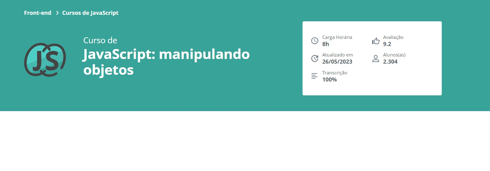

##
### JavaScript: manipulando objetos
##

  

  

##
### Parte 1 - Iniciando o projeto
##

### 1 - Apresentação

**Apresentação**

**Faça esse curso de JavaScript e:**

Entenda o que são e como manipular objetos no JavaScript
Conecte o projeto a um armazenador de dados do navegador(a API localStorage)
Implemente métodos para manipulação de elementos no DOM
Conheça características de desenvolvimento de código em JavaScript
Crie métodos para receber dados da pessoa usuária

- Exemplo:
  - js_manipulando_objetos_01

