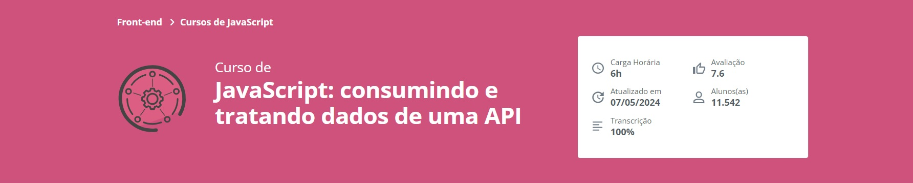

##
### JavaScript: consumindo e tratando dados de uma API
##

  

##
### Parte 1 - Apresentação e layout do projeto
##

### 1 - Apresentação

**Apresentação**

- Exemplo:
  - js_vidflow_api_01

### 2 - Preparando o ambiente: boas-vindas ao curso

**Preparando o ambiente: boas-vindas ao curso**

Olá, dev!
Boas vindas ao curso de Consumo de APIs com JavaScript!

Para começarmos, gostaríamos de garantir que você tenha a melhor experiência possível ao longo deste curso. Vamos juntos seguir alguns passos para preparar o ambiente:

- 1. Visual Studio Code (VSCode)
No decorrer do curso, usaremos o editor de código Visual Studio Code (VSCode). Caso você ainda não tenha o VSCode instalado em seu sistema, recomendamos reservar um tempinho para fazer a instalação. Você pode baixar o VSCode gratuitamente em https://code.visualstudio.com/ e seguir as instruções de instalação para o seu sistema operacional.

- 2. Código do Projeto Base
Utilizaremos também um projeto base como ponto de partida, que incluirá os arquivos do VidFlow e a pasta com as imagens que usaremos para compor o layout. Você pode acessar o projeto base através do repositório no GitHub ou, se preferir, baixá-lo diretamente aqui..

- https://github.com/alura-cursos/projeto-vidflow/tree/main

- 3. Layout no Figma
E ainda, trabalharemos com um layout pronto, construído pelo time de designers do VidFlow e que transformaremos em código. Para visualizar o layout, acesse o Figma e explore os elementos da aplicação.

- https://www.figma.com/design/a0crwitCtGmNIQW0RVIs5H/VidFlow-%7C-Curso-Js---Consumindo-dados-de-uma-API?node-id=0-1

Em caso de dúvidas ao longo deste curso, sinta-se à vontade para interagir conosco por meio do Discord da Alura. Lá você pode encontrar toda a equipe de pessoas instrutoras e também me encontrar no perfil #rafasilverio. Estamos aqui para te apoiar na construção do seu conhecimento! Mesmo que você não tenha dúvidas no momento, seria ótimo ver você por lá e acompanhar o seu progresso. Vamos aprender juntos!

Ao infinito e além! Vamos explorar novos horizontes de conhecimento juntos!

- Exemplo:
  - js_vidflow_api_02

### 3 - Conhecendo o projeto

**Conhecendo o projeto**

- Exemplo:
  - js_vidflow_api_03

### 4 - Construindo o cabeçalho

**Construindo o cabeçalho**

- Exemplo:
  - js_vidflow_api_04

